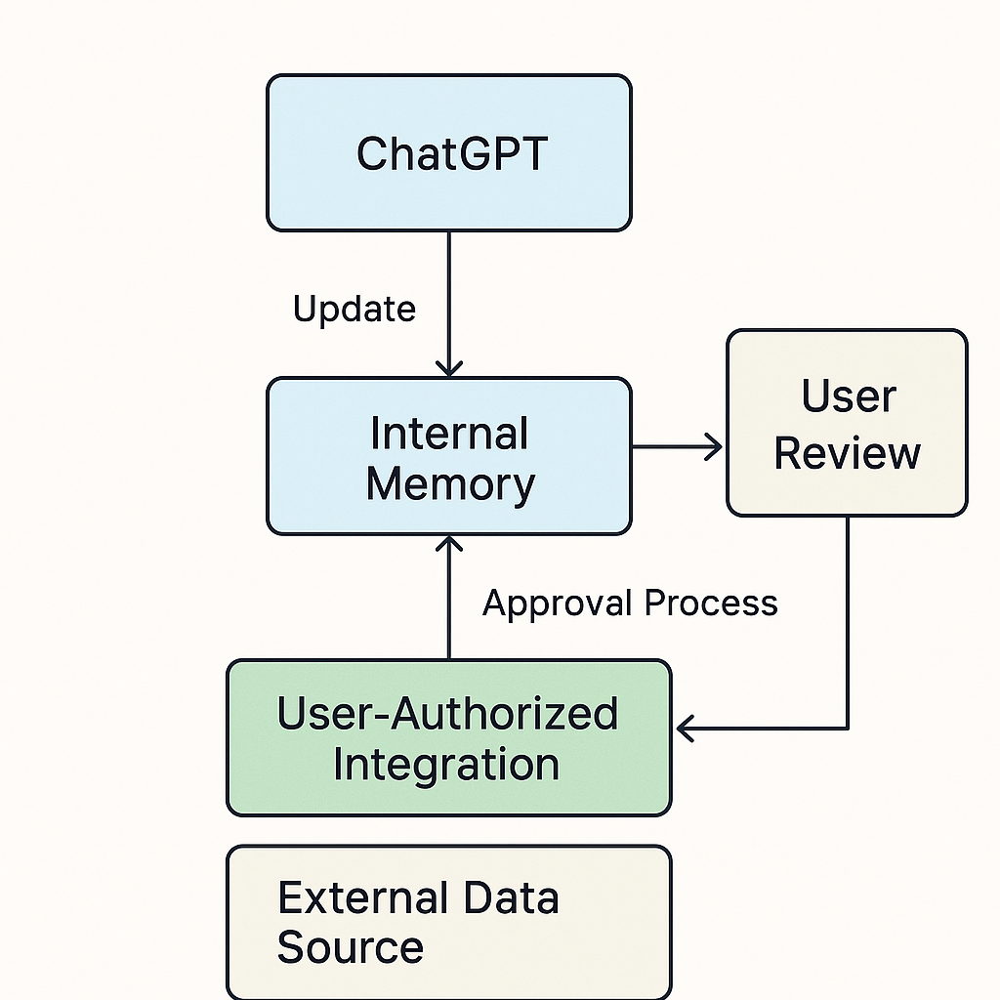

# Structured Memory Input for ChatGPT

> Technical feature request authored by **Tiago Valença**

---

## 📘 Overview

This repository documents a proposed feature for ChatGPT: a **secure, structured, user-authorized method of updating memory** with external data (such as Google Calendar, Notion, or task lists). The goal is to enable **real-world assistant behavior** without compromising user privacy or autonomy.

---

## 🎯 Purpose

While ChatGPT's memory feature is powerful, it currently lacks a way to be enriched passively or programmatically by **external sources of truth**. Today, users must manually enter daily plans, personal context, and project updates.

This proposal introduces the idea of a **Memory Input API** or memory ingestion layer, allowing structured data to be suggested or accepted into memory based on user-defined controls.

---

## 🔒 Guiding Principles

- **User consent is central**: All inputs must be authorized.
- **Privacy and security first**: No scraping or automation of the interface.
- **Structured input only**: JSON or other structured formats.
- **Clear boundaries**: No autonomous actions required — ChatGPT should only "know", not "do".

---

## 🧠 Use Cases

- Integrate daily summaries from automated scripts.
- Push calendar data (meetings, appointments).
- Feed ChatGPT contextual info like mood, stressors, or family logistics.
- Let ChatGPT remember recurring personal events without repeating input manually.

---

## 🧾 Examples

Explore real input examples in the [`examples/`](./examples) folder:

- [`daily_summary.json`](./examples/daily_summary.json)
- [`event_schedule.json`](./examples/event_schedule.json)
- [`task_list.json`](./examples/task_list.json)

---

## 🧭 Proposed Flow

A simplified visual of the proposed secure memory update process is available here:

---

## 📄 Full Proposal

The complete formal request submitted to OpenAI, including feedback and dialogue, can be found in [`docs/full-proposal.md`](./docs/full-proposal.md).

---

## 📬 Status

This feature does **not exist yet** in ChatGPT and was submitted to OpenAI’s product team via official support channels and feedback agents. OpenAI acknowledged and appreciated the technical and privacy-conscious framing of the request.

This repository documents the full proposal for transparency, technical validation, and portfolio reference.

---

## 🤝 Contributions

At this stage, this project is a **personal technical proposal**, not an active development effort. While feedback is welcome, **pull requests and code contributions are not being accepted** unless explicitly requested.

You are welcome to open an issue for discussion or share your thoughts via GitHub Issues if this proposal resonates with you.

If the project evolves into a collaborative implementation, particularly in partnership with OpenAI or aligned developers, the following steps can be taken to re-enable contributions:

- [ ] Remove or adjust the current branch protection rules
- [ ] Update this README to reflect new contribution guidelines
- [ ] Add a `CONTRIBUTING.md` file with scope and technical standards
- [ ] Define `CODEOWNERS` if needed for shared responsibilities

Until then, the repository remains in **documentation and proposal mode only**.

See [CONTRIBUTING.md](./CONTRIBUTING.md) for more details.

---

## 👤 Author

**Tiago Valença**  
Software developer and AI user  
[GitHub Profile](https://github.com/tqvalenca)  
[About.me Profile](https://about.me/tvalenca)*

---

## 📄 License

This repository and all proposal content is licensed under the **MIT License**. This is a public, non-binding technical proposal and does not imply endorsement by OpenAI or any affiliation beyond user feedback.
